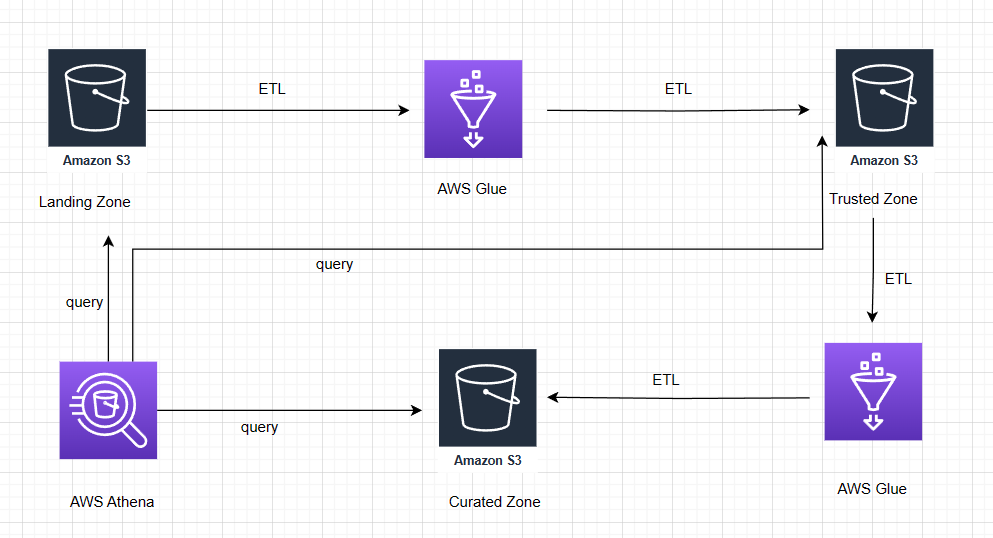

# STEDI Human Balance Analytics

This project aims to develop a data lakehouse solution for sensor data, facilitating the training of a machine-learning model for the STEDI team.

## Project Overview
The STEDI Team has been diligently working on a hardware STEDI Step Trainer, designed to:

- Assist users in performing STEDI balance exercises.
- Utilize sensors to gather data for training a machine-learning algorithm to identify steps.
- Include a companion mobile app for data collection and interaction with device sensors.

Several customers have already received their Step Trainers, downloaded the mobile app, and commenced testing their balance. The Step Trainer functions as a motion sensor recording object distances, while the app utilizes a mobile phone accelerometer to detect motion along the X, Y, and Z axes.

The objective is to utilize motion sensor data to train a machine-learning model for real-time step detection, with privacy considerations governing data usage.

Certain early adopters have consented to share their data for research, limiting training data to only these customers’ Step Trainer and accelerometer data.

## Project Summary
As a data engineer on the STEDI Step Trainer team, the task involves extracting data generated by the STEDI Step Trainer sensors and the mobile app, and organizing them into a data lakehouse solution on AWS for Data Scientists to train the learning model. Key tools employed include:

- Python and Spark
- AWS Glue
- AWS Athena
- AWS S3

## Project Data
### Customer Records
These records, sourced from fulfillment and the STEDI website, encompass various fields:

- Serial number
- Share with public as of date
- Birthday
- Registration date
- Share with research as of date
- Customer name
- Email
- Last update date
- Phone
- Share with friends as of date

### Step Trainer Records
Data from the motion sensor comprises:

- Sensor reading time
- Serial number
- Distance from object

### Accelerometer Records
Collected from the mobile app, these records include:

- Timestamp
- User
- X, Y, and Z axis readings

## Solution Overview
The data lake solution is constructed utilizing AWS S3, as depicted in the diagram.

Raw data is processed through various zones:

### Landing Zone - Data Ingestion
Raw data is stored in S3 buckets in the landing zone and subsequently ingested into Glue jobs for ETL processing. Glue tables are created from S3 landing buckets prior to querying through Athena.

### Trusted Zone - Consent Management
Customer data from the website (Landing Zone) is sanitized, retaining records only from customers who consented to share data for research. Similarly, accelerometer data from the mobile app (Landing Zone) is sanitized, storing readings solely from consenting customers.

### Curated Zone - Machine Learning Data
Customer data from the Trusted Zone is further sanitized, creating a Glue Table in the Curated Zone comprising customers with accelerometer data who agreed to share for research. Additionally, Step Trainer IoT data streams (S3) are read and used to populate a Trusted Zone Glue Table. Finally, an aggregated table is created, including Step Trainer readings and associated accelerometer data for the same timestamp, limited to consenting customers, under the Glue table named machine_learning_curated.